<!DOCTYPE html>
<html lang="ja">
<head>
    <meta charset="UTF-8">
    <meta name="viewport" content="width=device-width, initial-scale=1.0">
    <title>ブリーチの説明</title>
    <link rel="stylesheet" href="styles.css">
</head>
<body>
    <header>
        <h1>ブリーチの説明</h1>
    </header>
    <main>
        <section id="description-section">
            <h2>ブリーチとは</h2>
            
ブリーチは、久保帯人によって描かれた日本の漫画作品で、死神代行の物語を描いています。

        </section>
        <section id="image-section">
            <h2>ブリーチのキャラクター</h2>
            

                
                
ブリーチのキャラクター

            

            

                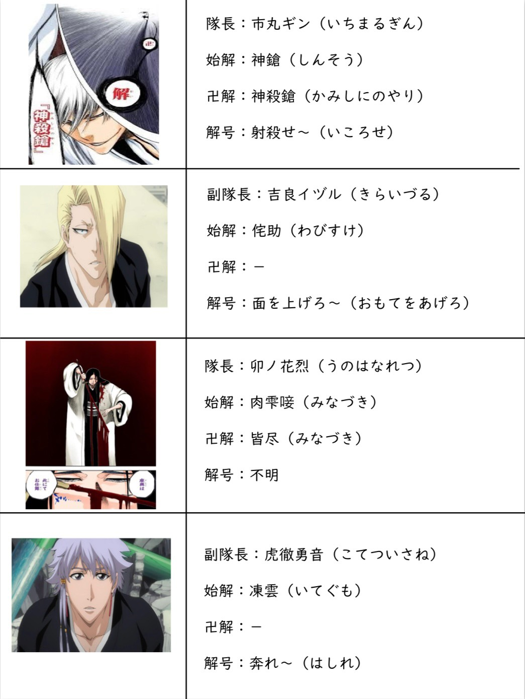
                
ブリーチのキャラクター1

            

            

                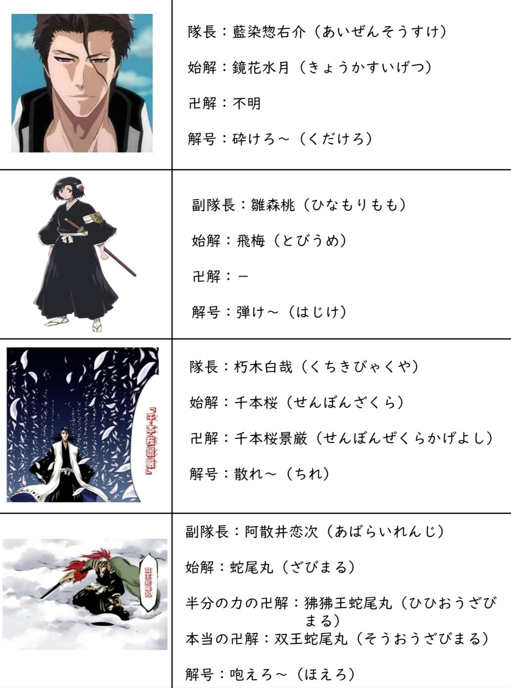
                
ブリーチのキャラクター2

            

            

                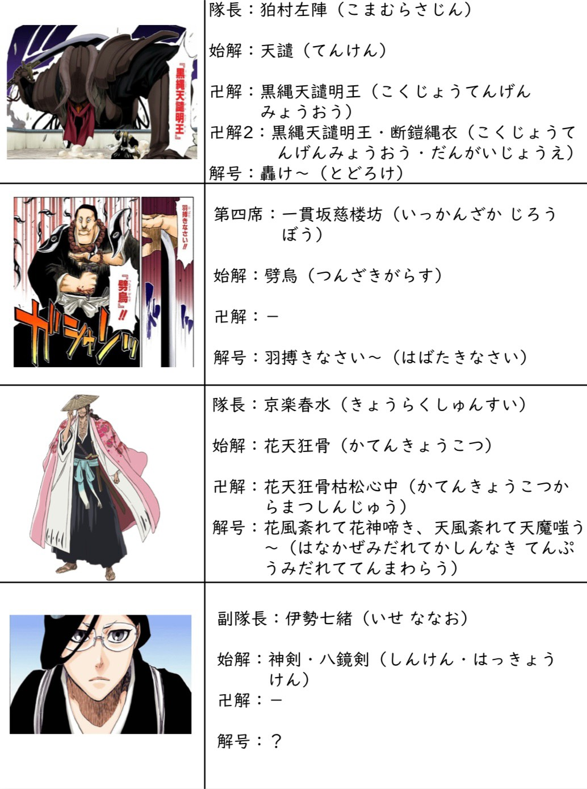
                
ブリーチのキャラクター3

            

            

                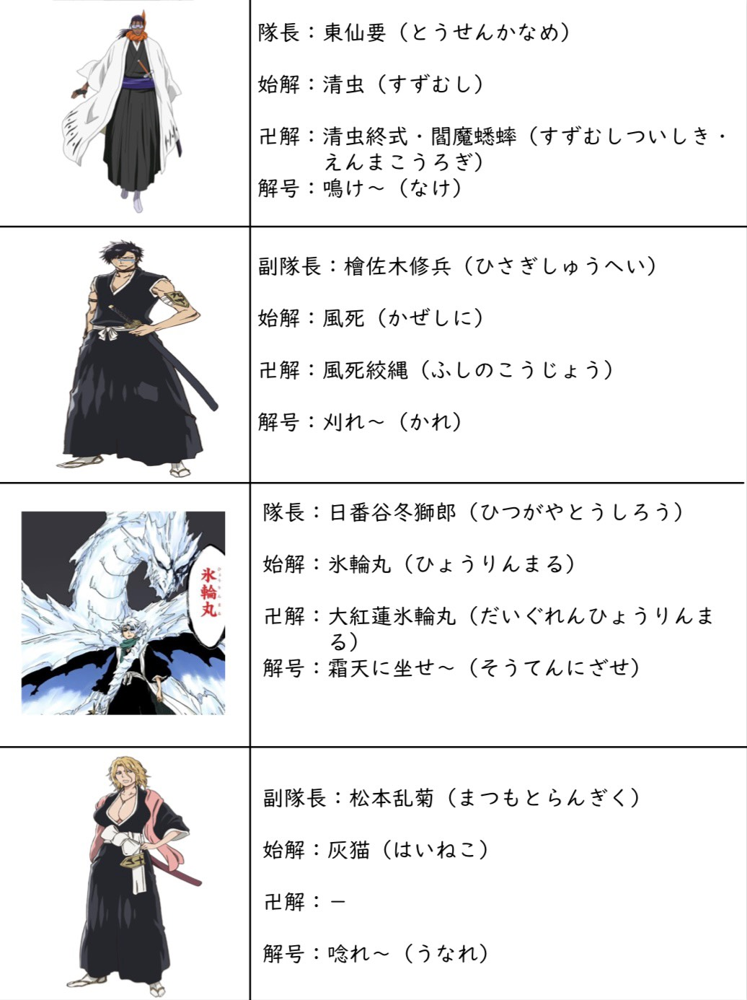
                
ブリーチのキャラクター4

            

            

                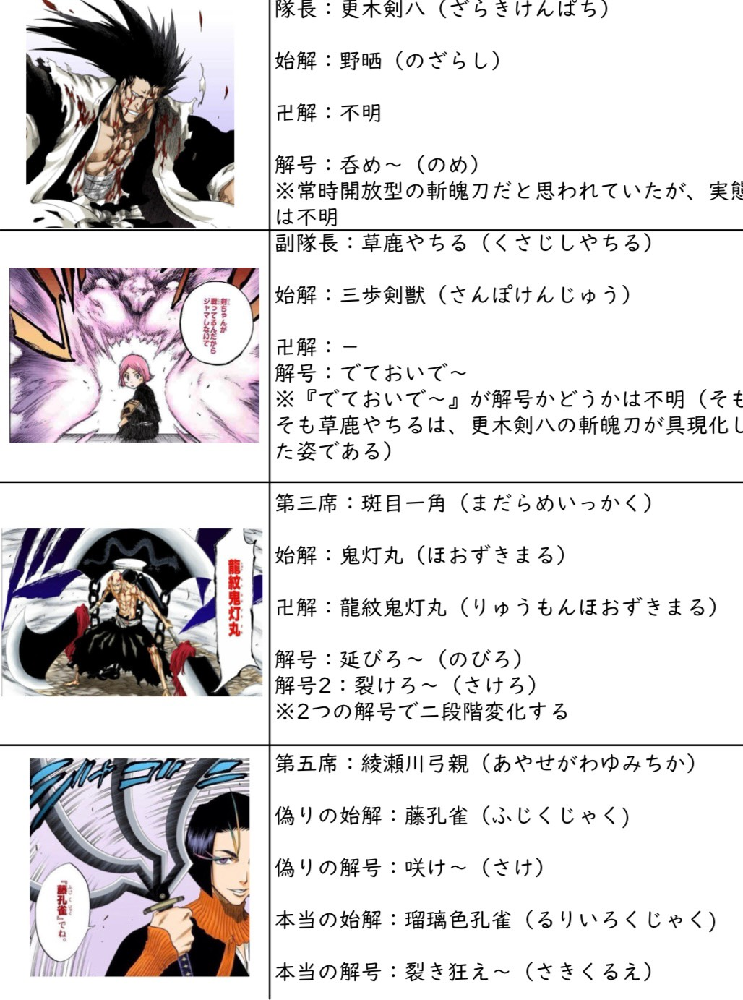
                
ブリーチのキャラクター5

            

            

                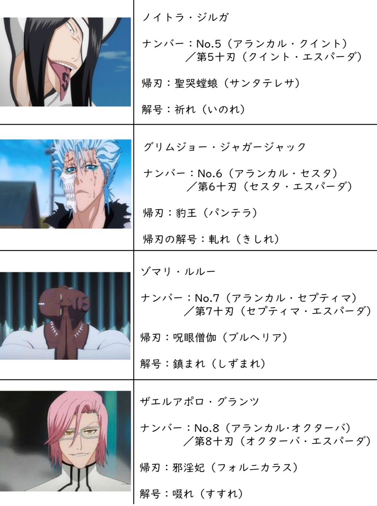
                
ブリーチのキャラクター6

            

            

                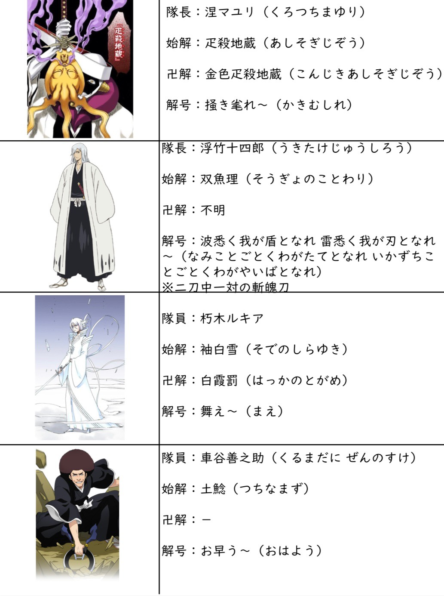
                
ブリーチのキャラクター7

            

            

                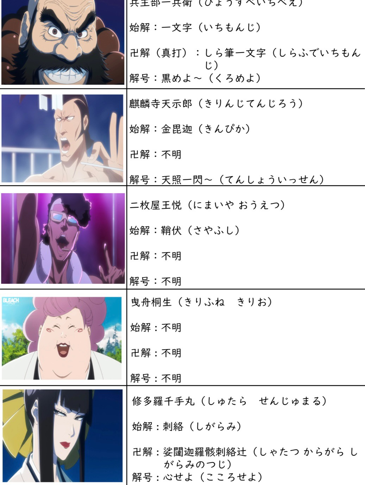
                
ブリーチのキャラクター8

            

            

                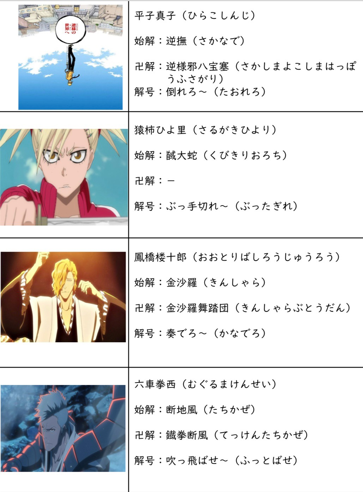
                
ブリーチのキャラクター9

            

            

                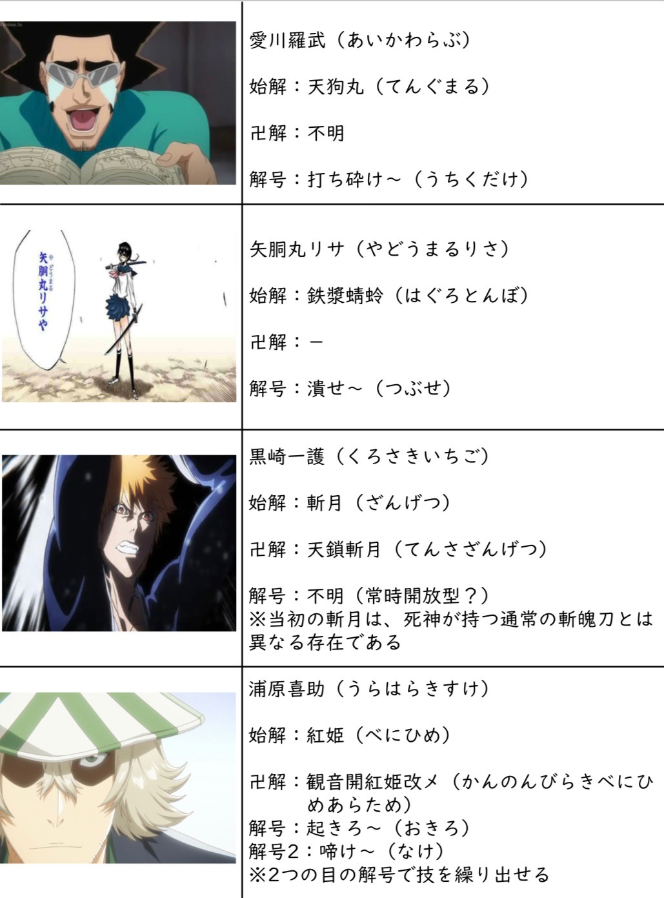
                
ブリーチのキャラクター10

            

            

                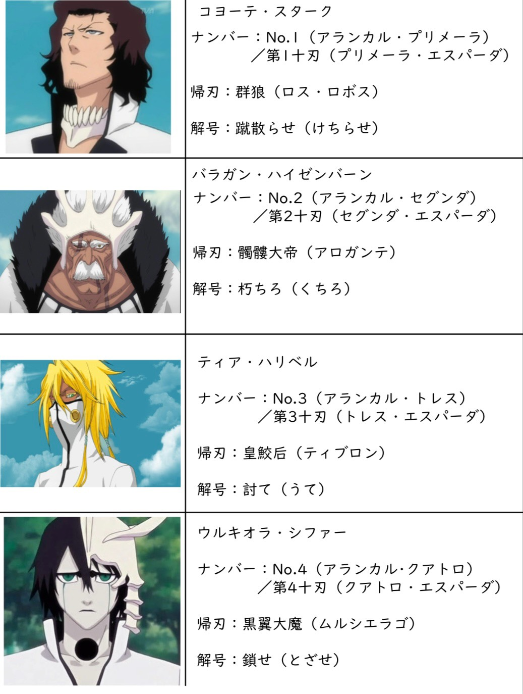
                
ブリーチのキャラクター11

            

            

                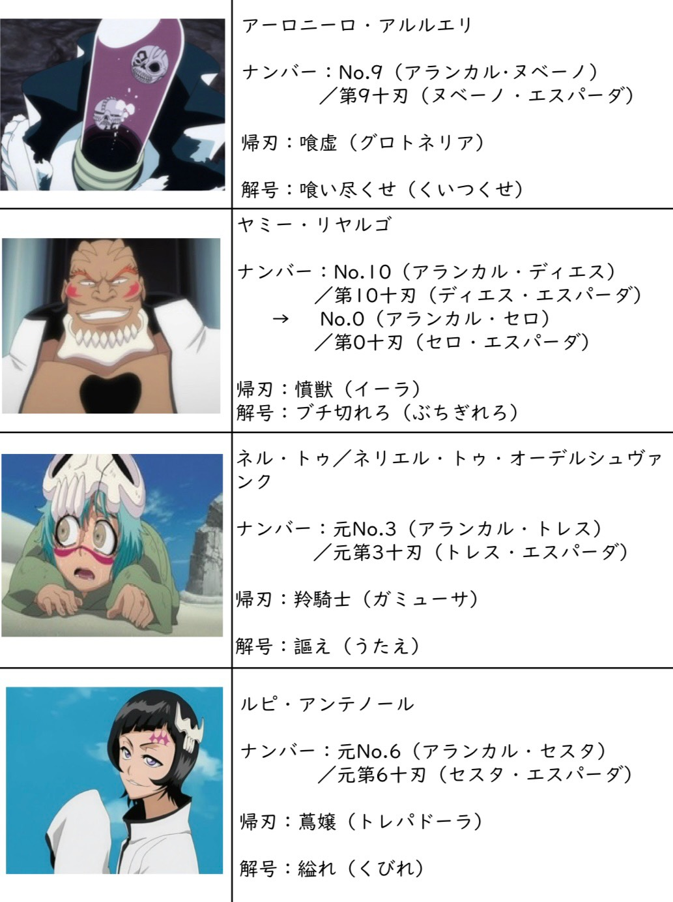
                
ブリーチのキャラクター12

            

            

                
                
ブリーチのキャラクター13

            

        </section>
    </main>
</body>
</html>
